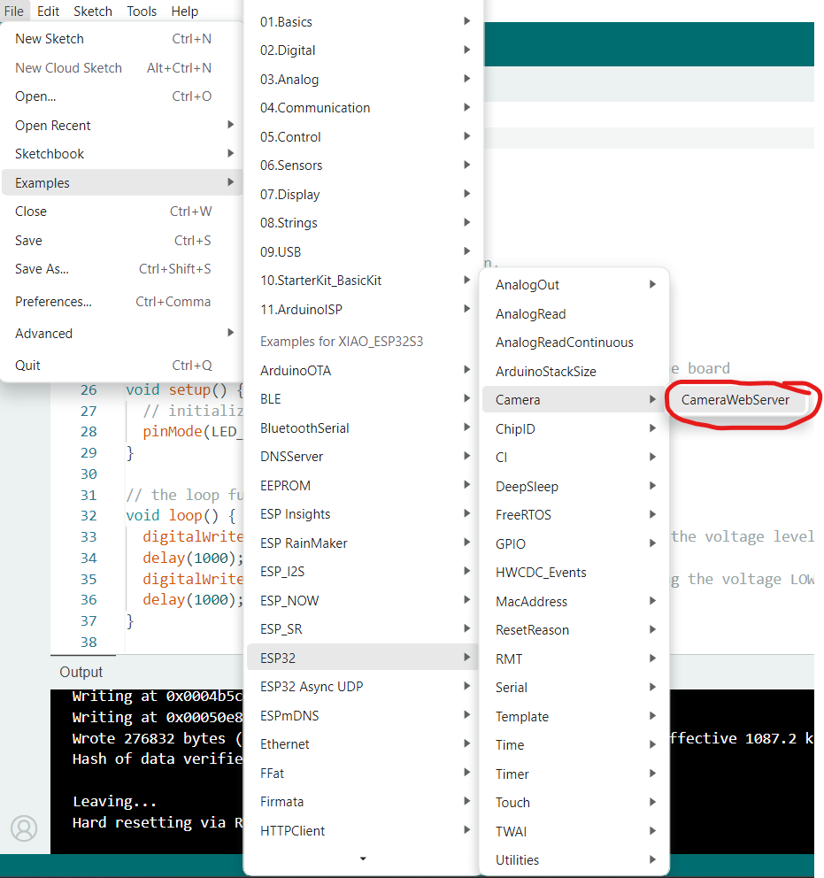
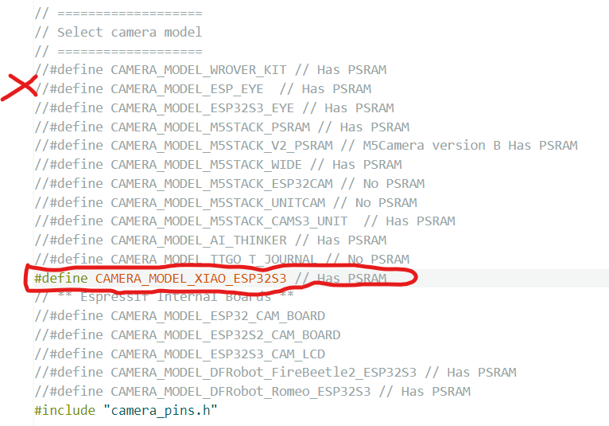
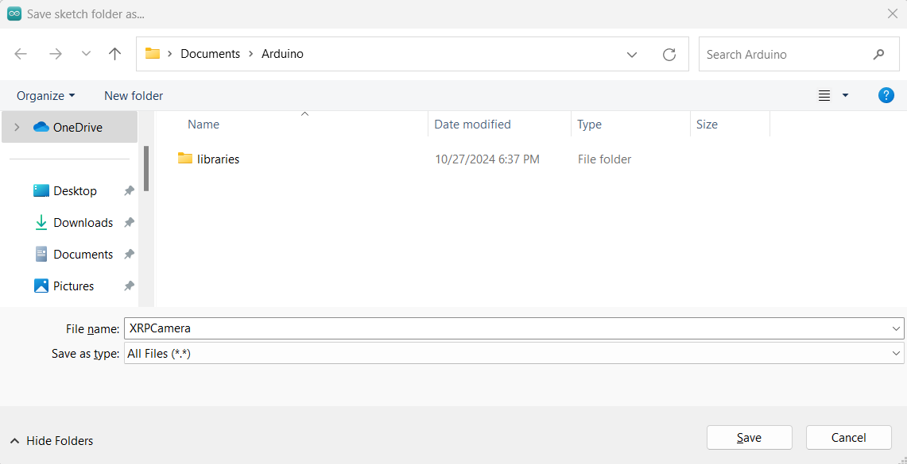

0. After installing ESP32 libraries, start with ESP32 > Camera > CameraWebServer example
(which we will be modifying)



1. Comment out the ESP32_EYE camera (we do not have it), and uncomment the CAMERA_MODEL_XIAO_ESP32S3 since this is what we have


2. Setup the SSID and password to whatever you want them to be, and also wifi access point IP addresses

```
const char *ssid = "XRPCam-JJ";
const char *password = "xrp-wpilib";
IPAddress cameraIP(192, 168, 42, 21);
IPAddress subnetMask(255, 255, 255, 0);

bool wifiStarted = false; // this variable will be set =true, if WiFi starts with addresses above
```

3. Replace the original code at the end of the setup() function that connects to WiFi (WiFi.begin(), WiFi.status() etc, "wifi connected") and starts camera server
...
with the code that sets up a new WiFi access point instead and starts the camera server on its IP address:

```
  bool accessPointWasSetup = WiFi.softAPConfig(cameraIP, cameraIP, subnetMask);
  bool accessPointStarted = WiFi.softAP(ssid, password);

  if (accessPointWasSetup && accessPointStarted) {
    startCameraServer();
    wifiStarted = true;

    Serial.print("Camera Ready! Use 'http://");
    Serial.print(WiFi.softAPIP()); // we have to use the address of the soft access point
    Serial.println("' to connect. Add ':81/stream' for video stream URL.");
    pinMode(LED_BUILTIN, OUTPUT); // prepare to blink the built-in orange LED, so everyone knows the wifi access point is up
  }
  else if (!accessPointWasSetup) {
    Serial.println("ERROR: WiFi.softAPConfig() failed");
  }
  else if (!accessPointStarted) {
    Serial.println("ERROR: WiFi.softAP() failed");
  }
```

4. To blink the LED if wifi was started successfully, the main loop should look like this:

```
void loop() {
  if (wifiStarted) {
    delay(500);                       // wait for 500ms
    digitalWrite(LED_BUILTIN, HIGH);  // turn the LED on (HIGH is the voltage level)
    delay(500);                       // wait for 500ms
    digitalWrite(LED_BUILTIN, LOW);   // turn the LED off (LOW is the voltage level)
  } else {
    delay(500);                       // wait for 500ms without blinking
  }
}
```

5. Optional, but we are using a more expensive wide-angle camera sensor OV5640 (not OV3660)
, change the resolution and other settings to make it work better for XRP.

Right under the OV3660 setup code, add the setup code for OV5640 camera sensor and also change the resolution to VGA (which is 640x480):
 - flip the pixels right-to-left (horizontal mirror),
 - increase the contrast level from 0 to +1 (make light objects lighter and dark ones darker),
 - and since frames are sent over WiFi using JPEG compression, reduce the amount of compression (quality) to just 5 (not 12), otherwise the quality loss sometimes causes problems with detecting AprilTags 

```
  sensor_t *s = esp_camera_sensor_get();
  // initial sensors are flipped vertically and colors are a bit saturated
  if (s->id.PID == OV3660_PID) {
    s->set_vflip(s, 1);        // flip it back
    s->set_brightness(s, 1);   // up the brightness just a bit
    s->set_saturation(s, -2);  // lower the saturation
  }
  if (s->id.PID == OV5640_PID) {
    Serial.println("Camera setup for OV5640");
    s->set_hmirror(s, 1);      // flip it back this way
    s->set_contrast(s, 1);
    s->set_quality(s, 5);
  }
  // drop down frame size for higher initial frame rate
  if (config.pixel_format == PIXFORMAT_JPEG) {
    s->set_framesize(s, FRAMESIZE_VGA);  // make it VGA (640x480)
  }
```

6. The sketch can be saved under new name, maybe "XRPCamera"? This way it can be put on many devices next, for the whole team.


